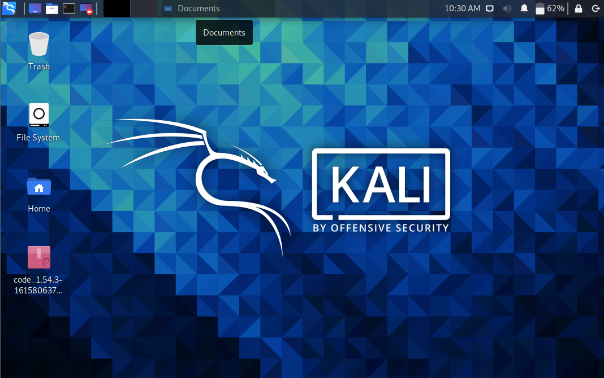
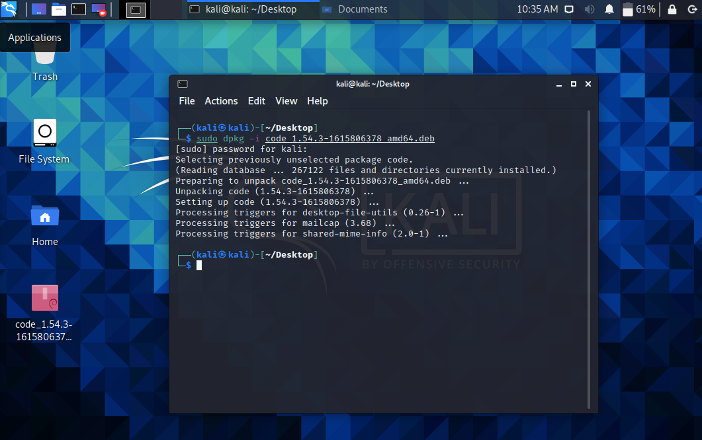
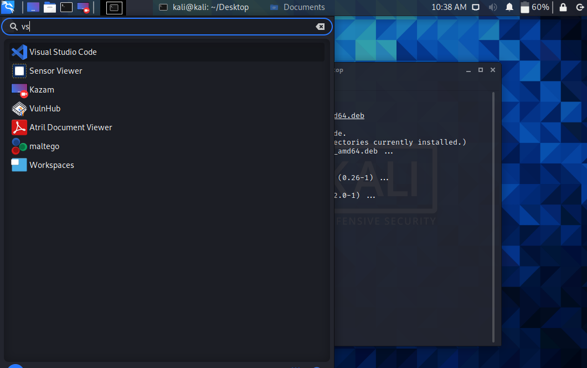
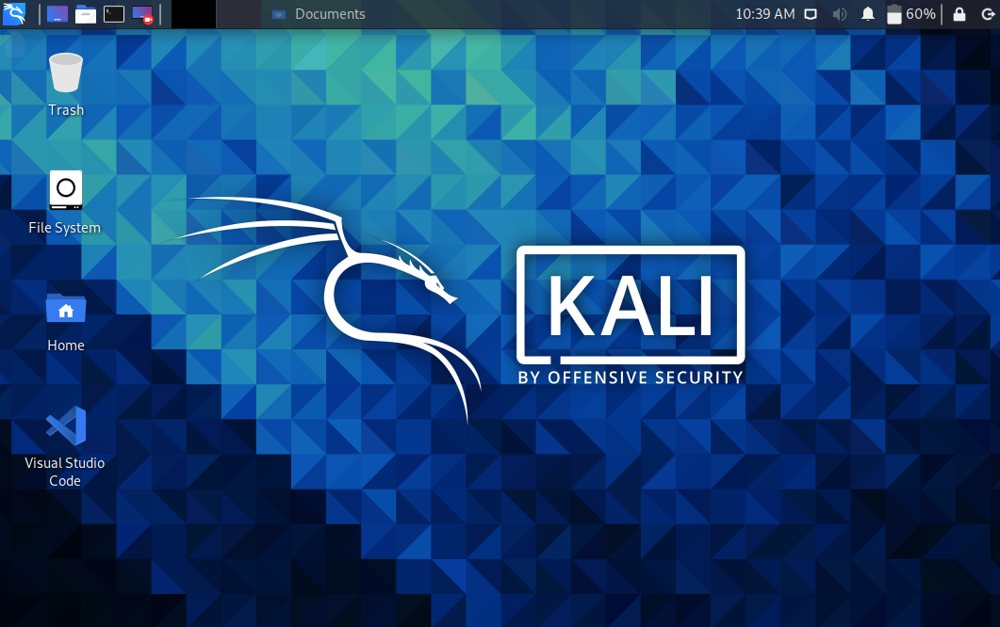

## 1. apt安装

需要知道需要安装的软件在apt源中的包名

命令

```shell
sudo apt-get install <软件名>
```

卸载

```shell
sudo apt-get remove <软件名>
```


## 2. deb包安装

deb包是基于Debian linux的发行版的软件安装包，其中，Ubuntu、kali都是基于Debian的linux发行版

### 2.1 下载要安装的deb包

以VScode为例，桌面上是一个已经下载好的vscodedeb安装包



### 2.3 命令行安装

在deb包所在位置打开终端，执行安装命令

```
sudo dpkg -i <包名>
```



### 2.4 添加快捷方式

安装好之后，不会像Windows一样自动创建桌面快捷方式，需要手动创建

首先找到安装好的VScode，点开左上角的kali图标，搜索



拖动到桌面就可以，此时deb安装包可以删除了

