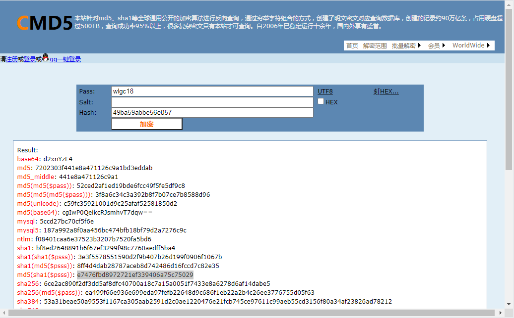
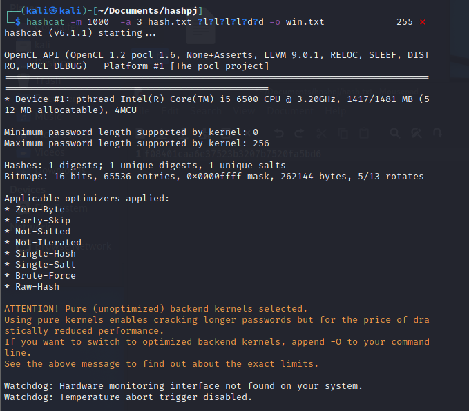

# hashcat

### hashcat简介

hashcat是一款自称为世界上最快的密码破解工具。


### hashcat常用命令

-m                           指定哈希类型

-a                            指定破解模式

-V                            查看版本信息

-o                            将输出结果储存到指定文件

--force                     忽略警告

--show                    仅显示破解的hash密码和对应的明文

--remove                 从源文件中删除破解成功的hash

--username             忽略hash表中的用户名

-b                             测试计算机破解速度和相关硬件信息

-O                            限制密码长度

-T                            设置线程数

-r                             使用规则文件

-1                             自定义字符集  -1 0123asd     ?1={0123asd}

-2                             自定义字符集  -2 0123asd    ?2={0123asd}

-3                             自定义字符集  -3 0123asd    ?3={0123asd}

-i                              启用增量破解模式

--increment-min       设置密码最小长度

--increment-max      设置密码最大长度


### hashcat破解模式介绍

0    straight                                           字典破解

1    combination                                    将字典中密码进行组合（1 2>11 22 12 21）

3    brute-force                                      使用指定掩码破解

6    Hybrid Wordlist + Mask                  字典+掩码破解

7    Hybrid Mask  + Wordlist                 掩码+字典破解


### hashcat集成的字符集

?l                代表小写字母

?u              代表大写字母

?d              代表数字

?s              代表特殊字符

?a              代表大小写字母、数字以及特殊字符  

?b               0x00-0xff 


暴力破解MD5的只：

1. 使用字典破解

   ```
   hashcat  -a 0  0192023a7bbd73250516f069df18b500  password.txt  --force
   ```

   

2. 制定字符集破解

   ```
   hashcat  -a 3  63a9f0ea7bb98050796b649e85481845  ?l?l?l?l --force
   ```

   

3. 字典+掩码进行破解

   ```
   hashcat  -a 6  1844156d4166d94387f1a4ad031ca5fa  password.txt  ?d?d?d --force
   ```


4. 使用掩码+字典进行


```
hashcat -m 1000 -a 3 hash ?d?d?d?d?d?d?d?d -o win --force
```


linux 密码文件

```
sudo vim /etc/shadow
```

用户密码

```
sudo viw /etc/passwd
```


## 实战破解hash密码

#### 1.将要破解的明文加密

网站：https://cmd5.com/

进入加密网页，输入要破解的明文，点击加密获取密文



Result里面就是"wlgc18"经过各种hash加密后的密文，随便选取一个密文（这里选择ntlm)

#### 2. 获取破解后的密文

打开kali，复制密文到文件（文件这里命名为hash.txt），创建一个空文件用来存放破解后的明文（这里命名为win.txt文件）


#### 3. 开始破解

在此文件夹打开终端用hash破解密文

```
hashcat -m 1000  -a 3 hash.txt ?l?l?l?l?d?d -o win.txt 
```



#### 4. 查看密文

运行成功后打开win.txt文件就可以看到密文对应的明文


