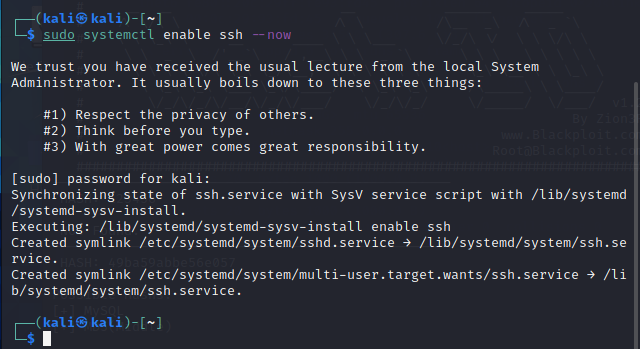
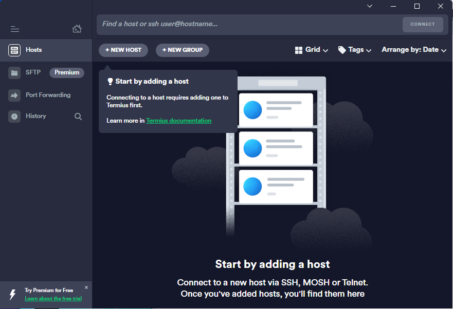
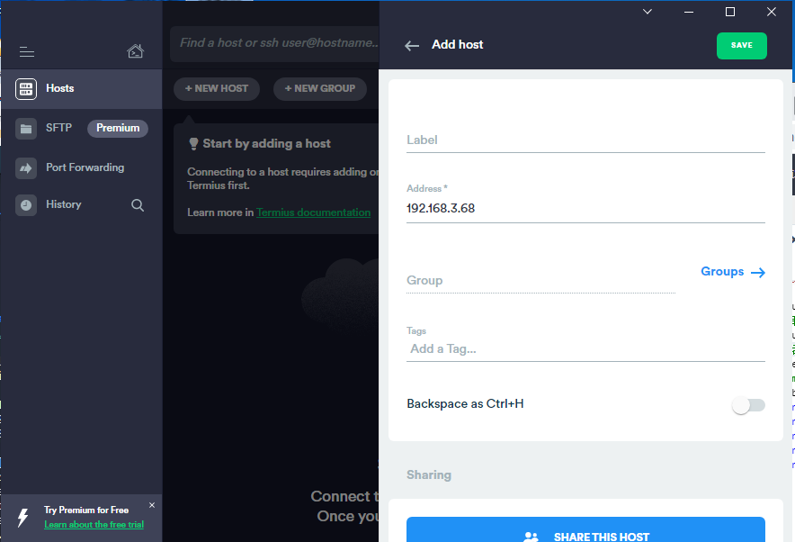
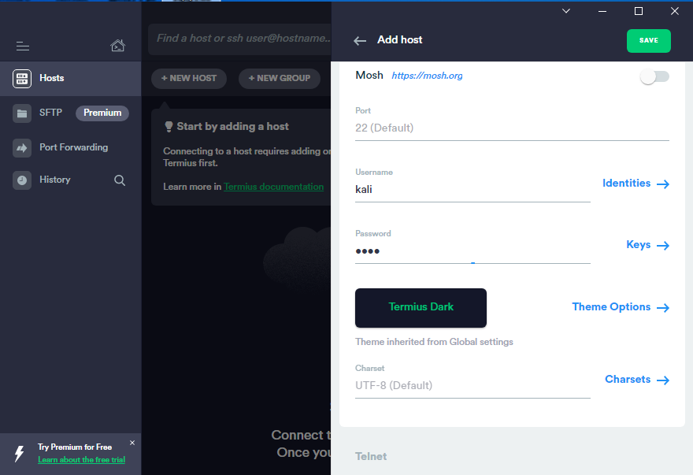
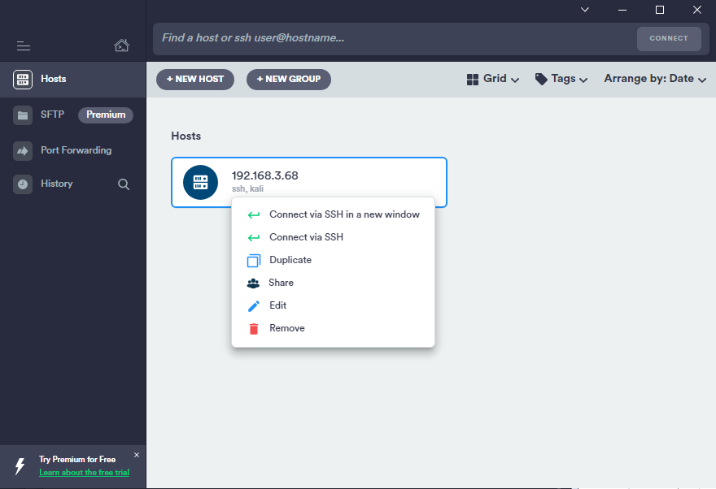
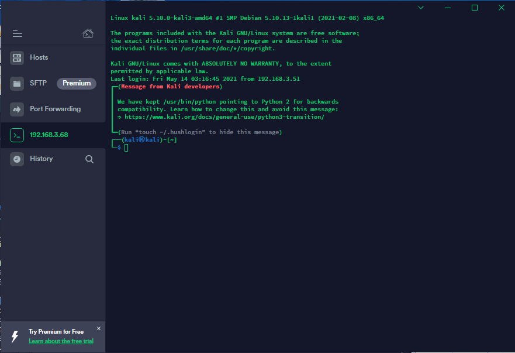
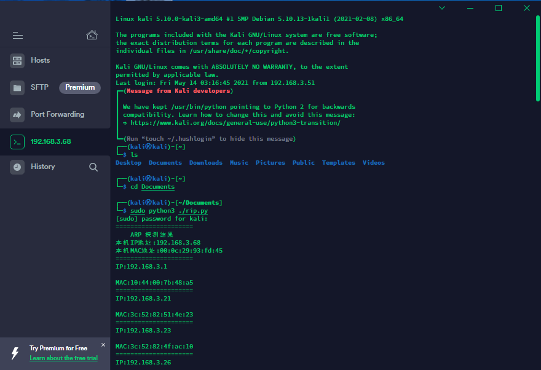

1. 在虚拟机中打开ssh服务，输入

   > sudo systemctl enable ssh --now

2. Windows下打开termius软件

3. 在打开的页面中点击new host，输入需要连接的虚拟机或服务器的IP地址和用户、密码

4. 点击多出来Hosts里的选项（三个点），点击Connect via SSH

5. 现在已经连接上虚拟机，可以像操作虚拟机的命令行一样操作虚拟机

6. 尝试运行rip扫描程序

