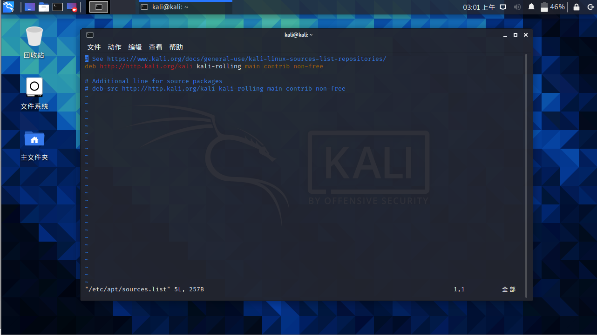
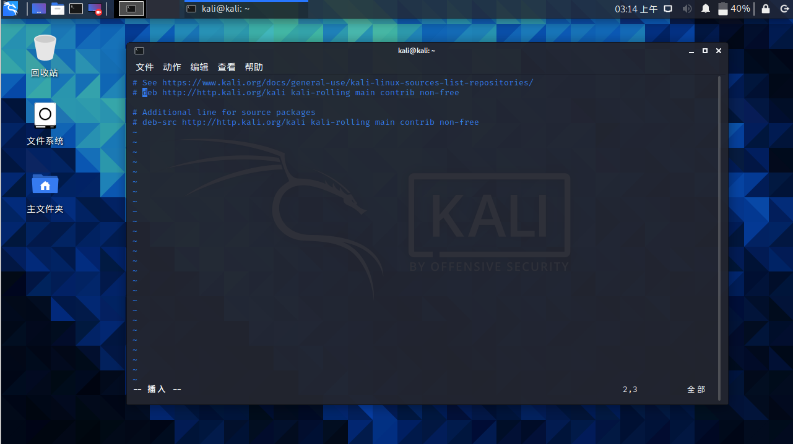
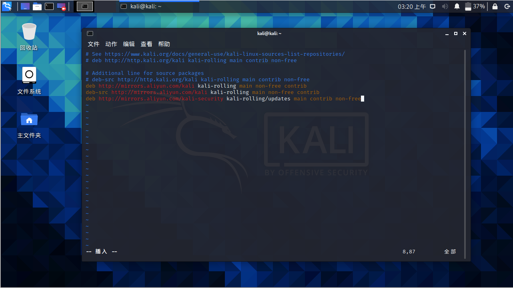
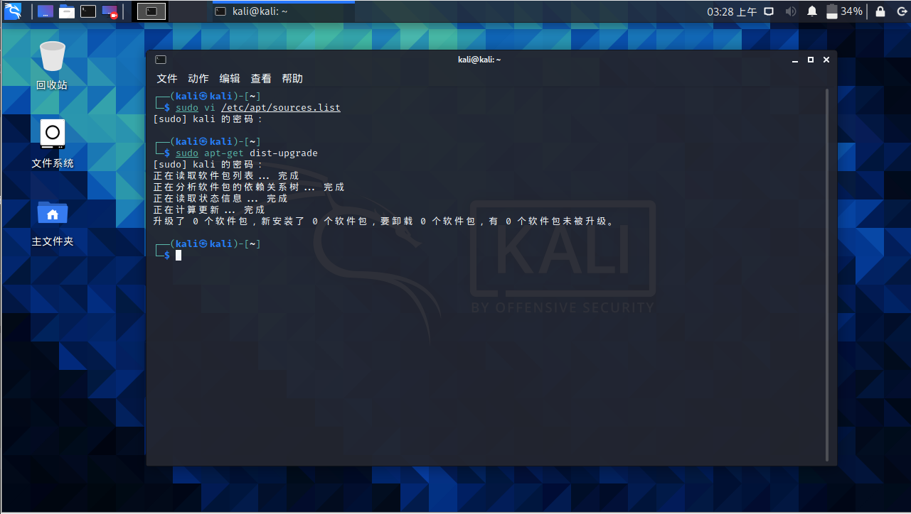
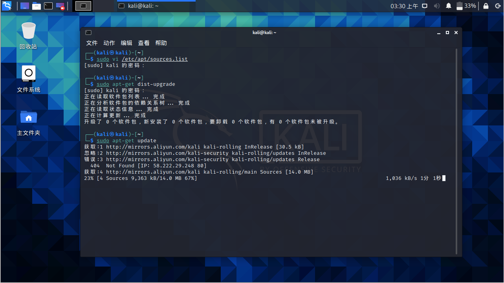
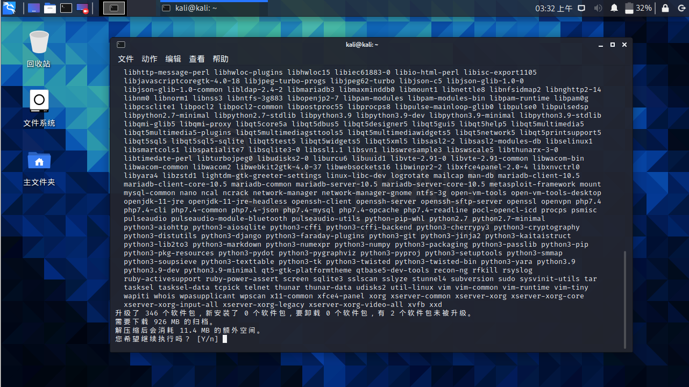

## 换源

1. 打开kali的终端

   

2. 编辑软件源，输入

   ```shell
   sudo vi /etc/apt/sources.list
   ```

   

3. 如果是非root的普通账户，会提示需要输入登录密码（2020版本后的默认用户kali也是普通用户），输入密码后回车进入软件源页面

   


4. 点击键入 i 进入编辑模式（此时窗口左下角会显示INSERT或插入），注释掉官方源

   

5. 添加国内源

   阿里云：

   ```cmd
   deb http://mirrors.aliyun.com/kali kali-rolling main non-free contrib
   deb-src http://mirrors.aliyun.com/kali kali-rolling main non-free contrib
   deb http://mirrors.aliyun.com/kali-security kali-rolling/updates main contrib non-free
   ```

   中科大：

   ```cmd
   deb http://mirrors.ustc.edu.cn/kali kali-rolling main non-free contrib  
   deb-src http://mirrors.ustc.edu.cn/kali kali-rolling main non-free contrib
   ```

   

6. 按Esc退出编辑模式，然后输入:wq（保存并退出），回车

   

至此，换源操作已完成


## 更新软件和软件源

1. 输入sudo apt-get dist-upgrade进行软件源清单更新，输入密码后回车

   

   

2. 输入sudo apt-get update，进行软件版本更新

   


3. 更新完成后再输入sudo apt-get upgrade进行更新

   


   此时输入y回车即可

第一次更新时间比较长，耐心等待更新完成，

