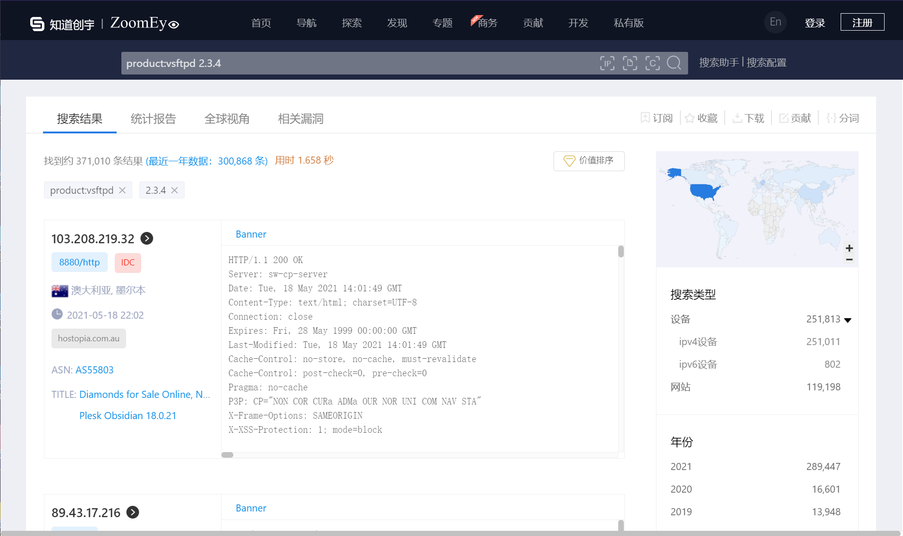

## 介绍

钟馗之眼是一个检索网络空间节点的搜索引擎。通过后端的分布式爬虫引擎（无论谁家的搜索引擎都是这样）对全球节点的分析，对每个节点的所拥有的特征进行判别，从而获得设备类型、固件版本、分布地点、开放端口服务等信息。

地址：https://www.zoomeye.org/


## 使用技巧

1. 搜索使用指定操作系统的主机

使用Windows操作系统的主机

```
os:windows7
```


2. 搜索使用指定app组件的

搜索使用阿帕奇的服务器

```
app:Apache
```


3. 扫描开放指定端口的主机

开放3306端口的主机

```
port:3389
```


4.扫描存在笑脸漏洞的主机

```
product:vsftpd 2.3.4
```


