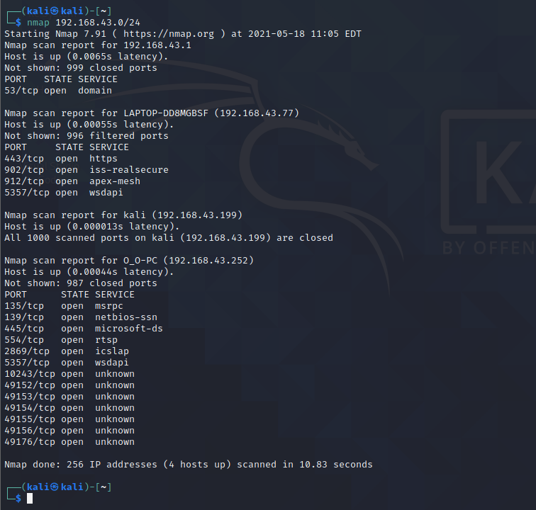
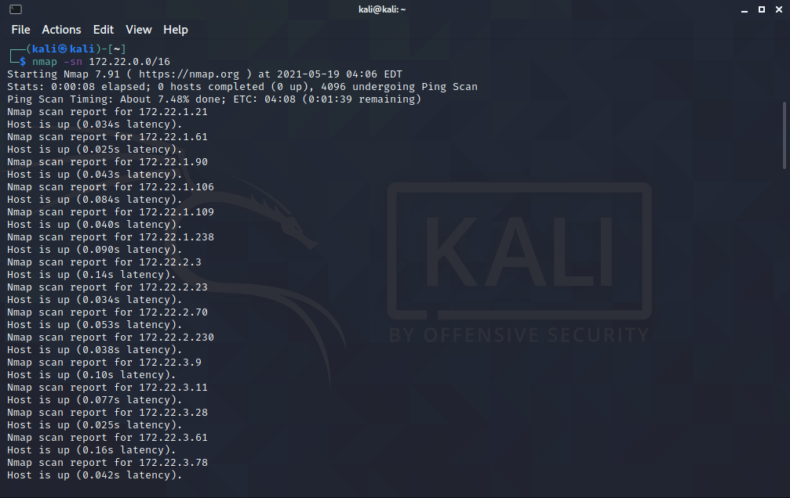
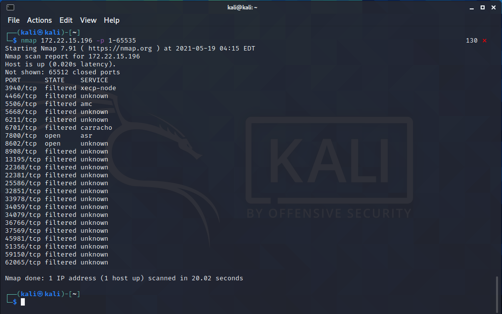

## 介绍

NMap，也就是Network Mapper，是Linux下的网络扫描和嗅探工具包。

　其基本功能有三个：

（1）扫描主机端口，嗅探所提供的网络服务

（2）探测一组主机是否在线

（3）还可以推断主机所用的操作系统，到达主机经过的路由，系统已开放端口的软件版本


1. 扫描一个网段内存活的主机

```
nmap 192.168.43.0/24
```



2. 使用ping方式进行扫描

```
nmap -sn 192.168.*.*/*
```



3. 扫描指定主机的端口

```
nmap 192.168.*.* -p 1-65535
```

```
nmap 192.168.*.* -p 80,8080,3306
```



