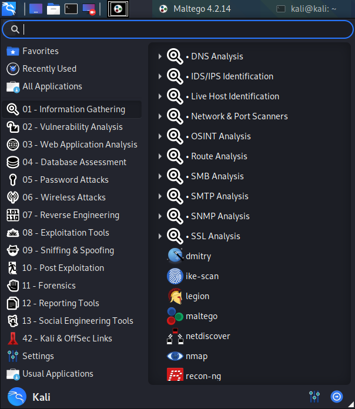
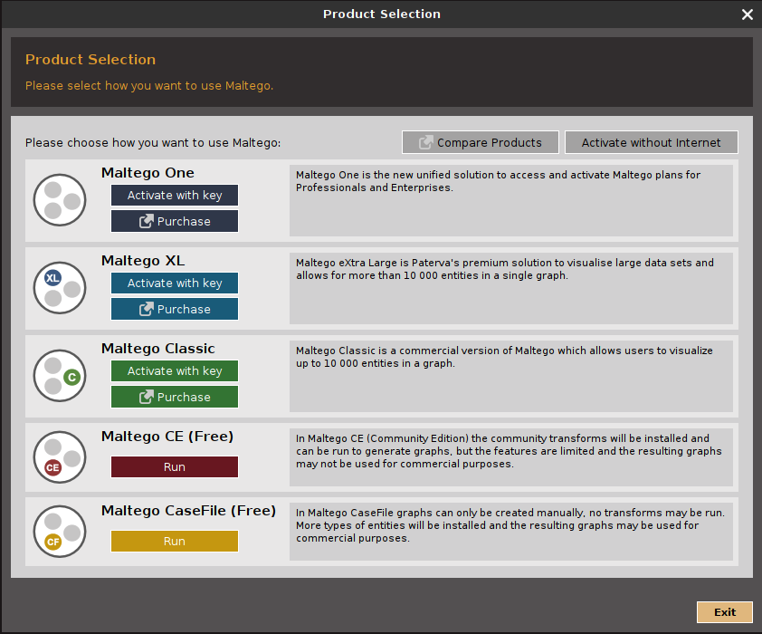
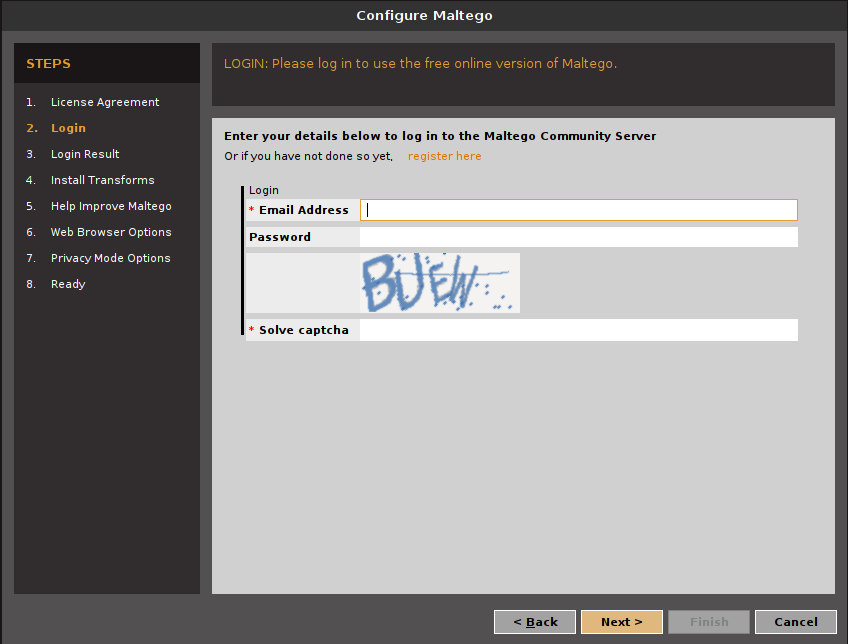

# maltego搜索子域名信息

## 介绍

Maltego是⼀款信息收集软件，可以从各种渠道收集⽬标的信息，并将这些信息显示在适于执⾏链路分析的、基于节点的图形上。

## 准备工作

1. 启动

   打开kali，在应用里找到maltego（01-信息收集-maltego）

   

2. 注册与登录

   进⼊Maltego后，会出现⼀个版本选择界⾯，选择Maktego CE里面的run，接下来会显示⼀个登录界⾯。

   

   点击accept，next后进入登录界面

   

   没有账号需要进入官网注册（官网在国内被墙）

   注册网址：https://www.maltego.com/ce-registration/

   注册完即可登录

